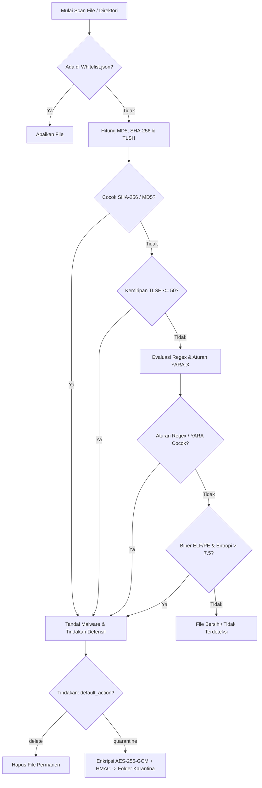
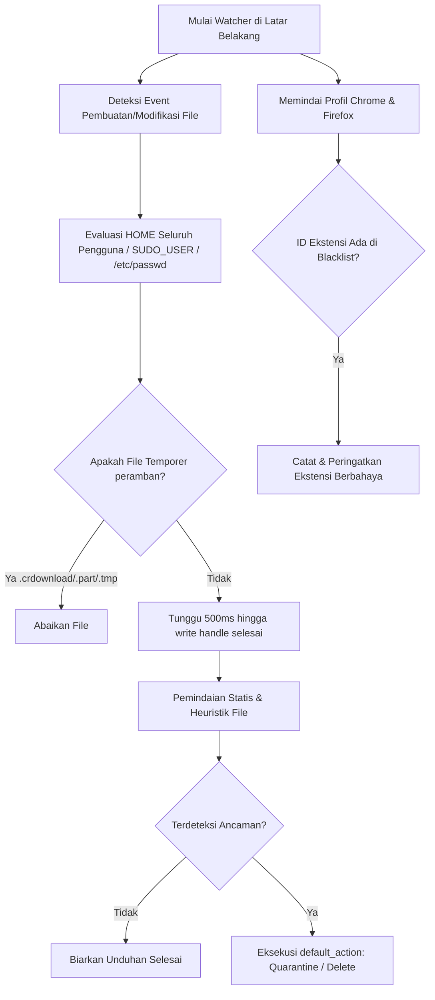
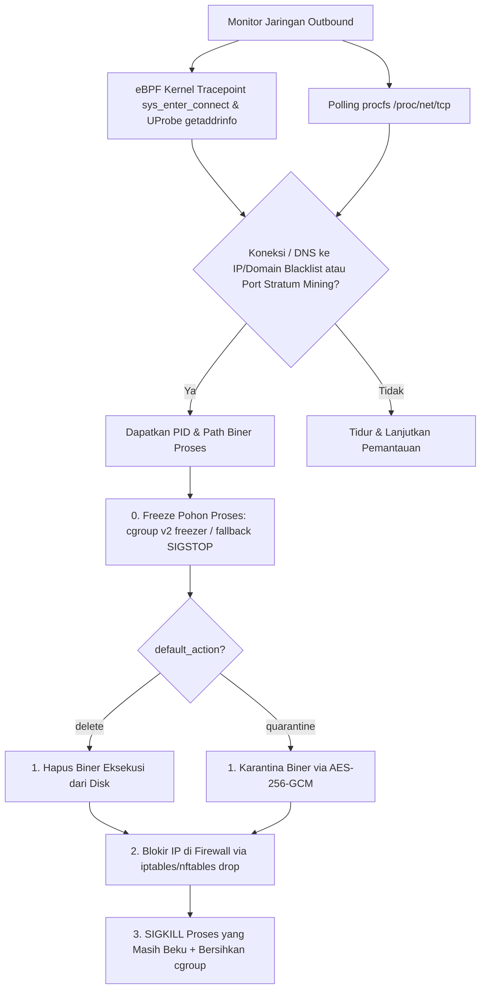

# FerroShield 🛡️

**FerroShield** adalah aplikasi keamanan modular berkinerja tinggi untuk sistem operasi Linux yang ditulis dalam bahasa **Rust**. Aplikasi ini dirancang untuk mendeteksi malware secara statis, heuristik, dan YARA-X, memantau folder unduhan peramban secara real-time (*Browser Guard*), membatasi pertambangan kripto (*Cryptomining Prevention*), serta menghentikan koneksi jaringan berbahaya melalui pemantauan tingkat kernel **eBPF** (*Network Mitigation*). FerroShield menyediakan Command Line Interface (CLI) yang kaya fitur serta **Web Dashboard** interaktif yang berjalan secara efisien dengan konsumsi memori minimal (< 10MB RAM).

---

## 🎯 Tujuan Proyek
1. **Proteksi Ringan & Efisien**: Memanfaatkan keunggulan performa Rust dan efisiensi eBPF untuk pemantauan latar belakang dengan overhead sistem yang sangat rendah.
2. **Deteksi Ancaman Komprehensif**: Menggabungkan pencocokan hash statis (MD5, SHA-256), *TLSH Fuzzy Hashing* (kemiripan varian malware), aturan **YARA-X**, regex, serta *Heuristic Entropy Check* untuk biner terkemas/terenkripsi.
3. **Keamanan Unduhan & Ekstensi Real-Time**: Mencegah masuknya file berbahaya dari internet dengan memindai setiap file yang selesai diunduh di seluruh akun pengguna, serta memeriksa ekstensi Google Chrome dan Mozilla Firefox terinstal.
4. **Mitigasi Jaringan & Aktivitas Kripto (Dual-Layer)**: Memantau rute jaringan via `/proc/net/tcp` dan kernel **eBPF** (`sys_enter_connect` & UProbe `getaddrinfo`) untuk menghentikan proses jahat, memblokir port pertambangan (stratum), dan memutus rute ke IP/domain berbahaya secara otomatis via `iptables` dan `/etc/hosts`.
5. **Karantina Kriptografis Aman**: Mengisolasi file terinfeksi menggunakan enkripsi tingkat lanjut **AES-256-GCM** dan verifikasi integritas **HMAC-SHA256** dengan proteksi *Master Key* agar aman berada di disk tanpa risiko eksekusi atau manipulasi.
6. **Verifikasi Integritas Aturan & Feed Otomatis**: Menjamin keabsahan berkas aturan `rules.json` menggunakan tanda tangan digital **Ed25519** (`rules.json.sig`) dan mendukung pembaruan *threat feed* otomatis dari sumber terpercaya (Feodo Tracker & URLhaus).

---

## 🛠️ Fitur Utama

- **Pemindai Multilapis & Resumable Scanner**:
  - **Pencocokan Hash & Fuzzy Hash**: Memindai berdasarkan hash MD5, SHA-256, serta **TLSH** (Locality Sensitive Hashing) untuk mengenali varian malware bermutasi (skor perbedaan ≤ 50).
  - **Aturan YARA-X & Regex**: Integrasi mesin YARA-X modern (`rules.yar`) dan regex pattern matching. Paket resmi menyertakan ruleset komunitas **12.419 aturan** (lihat [Ruleset YARA](#ruleset-yara-rulesyar)).
  - **Deteksi Heuristik Entropi**: Mendeteksi file eksekusi (ELF & PE) ber-entropi tinggi (> 7.5) yang dikemas (*packed*) atau dienkripsi malware, dengan filter cerdas pada artefak build/kompiler.
  - **Resumable Scan**: Pemindaian direktori dapat **dijeda, dihentikan, dan dilanjutkan** (*scan_state.json*) tanpa mengulang dari awal.
  - **Pengecualian Whitelist**: Mendukung *whitelist* kustom (`whitelist.json`) dengan *caching* otomatis berdasarkan waktu modifikasi berkas.
- **Browser Guard & Extension Guard**:
  - **Browser Guard**: Memantau folder unduhan (`Downloads` / `Unduhan`) seluruh pengguna sistem (melacak `/etc/passwd`, `SUDO_USER`, dan `HOME`) secara real-time. Memfilter otomatis file temporer peramban (`.crdownload`, `.part`, `.tmp`).
  - **Extension Guard**: Memeriksa direktori profil Google Chrome/Chromium dan Mozilla Firefox terhadap daftar ekstensi berbahaya.
- **Crypto-Miner & Network Guard (Kernel eBPF + Procfs)**:
  - Memantau koneksi TCP outbound aktif dan deteksi port pertambangan kripto (3333, 4444, 5555, 7777, 8888, 14444).
  - **Kernel-Space eBPF**: Melacak panggilan sistem `sys_enter_connect` dan UProbe DNS `getaddrinfo` langsung di level kernel menggunakan pustaka `aya`.
  - **Tindakan Defensif Anti-Mutasi & Anti-Watchdog (Freeze-First)**: Proses terdeteksi **dibekukan dulu** bersama seluruh keturunannya (*cgroup v2 freezer*, fallback `SIGSTOP`) sehingga tak bisa mengeksekusi kode/membuat file baru, kemudian biner eksekusi dikarantina/dihapus, IP diblokir via `iptables`/`nftables`, dan terakhir proses dibunuh dengan `kill -9` (mencegah malware twin/watchdog melakukan re-eksekusi biner dari disk ataupun bermutasi). Juga mendeteksi proses mencurigakan yang berjalan dari folder temporer (`/tmp/`, `/var/tmp/`, `/dev/shm/`, `/run/user/`).
- **Karantina Kriptografis (AES-256-GCM & HMAC)**:
  - Mengenkripsi berkas berbahaya dengan AES-256-GCM menggunakan *file key* dan *nonce* unik.
  - Memverifikasi integritas berkas terisolasi menggunakan HMAC-SHA256.
  - Mengamankan manifest metadata menggunakan *Master Key* (`master.key`) berhak akses terbatas (`0400`).
  - Menyimpan dan memulihkan izin hak akses asli (*file permissions*) saat proses *restore*.
- **Keamanan & Pengerasan Layanan (Hardening)**:
  - **Capability Dropping**: Menurunkan hak akses *root* yang tidak diperlukan dan hanya mempertahankan kapabilitas esensial (`CAP_NET_ADMIN`, `CAP_NET_RAW`, `CAP_KILL`, `CAP_DAC_OVERRIDE`).
  - **Web UI Lokal yang Aman**: Dashboard terikat ke `127.0.0.1`, memvalidasi header `Host`, menolak permintaan lintas-situs (`Origin`/`Sec-Fetch-Site`), **dan mewajibkan token akses** (di file `dashboard.token` mode `0600`) pada semua endpoint `/api/*` — sehingga proses lokal non-browser (mis. `curl`) tidak bisa memicu aksi destruktif terhadap daemon root.
  - **Firewall Nftables & Iptables**: Pemblokiran IP otomatis mendukung **nftables** (preferensi) maupun **iptables**, agar berfungsi di semua distribusi Linux.
  - **Integritas Aturan Ed25519**: Verifikasi tanda tangan `rules.json.sig` memakai kunci publik bawaan atau file `rules.pub`, sebelum memuat basis aturan.
  - **Pembaruan Threat Feed**: Perintah otomatis untuk mengunduh daftar hitam IP Feodo Tracker dan domain URLhaus, menggabungkan, serta menandatangani ulang `rules.json`.

---

## 🔄 Alur & Flow Sistem

### 1. Alur Pemindaian Multilapis (Multi-Layer Scan Flow)
Alur ini menggambarkan bagaimana file dievaluasi dari Whitelist, Hash statis, TLSH, Regex, YARA-X, hingga Entropi Heuristik:



### 2. Alur Browser Guard & Extension Guard
Memantau direktori unduhan secara dinamis di seluruh akun pengguna dan memindai ekstensi peramban:



### 3. Alur Proteksi Jaringan & Miner (eBPF + Procfs Mitigation Flow)
Pemantauan outbound TCP real-time pada level user-space dan kernel-space:



---

## ⚙️ Konfigurasi Basis Aturan (`rules.json`)

Seluruh database sidik jari malware, ID ekstensi, dan blacklist jaringan diatur dalam berkas `rules.json` yang dilindungi tanda tangan digital Ed25519 (`rules.json.sig`). **Pengaturan runtime** (`default_action`, `downloads_dir`, `process_containment`) dipisahkan ke `config.json` (tidak ditandatangani) sehingga dapat diubah tanpa menandatangani ulang:

```json
{
  "settings": {
    "default_action": "quarantine"
  },
  "rules": [
    {
      "id": "RULE-001",
      "name": "EICAR-Test-Signature",
      "description": "File uji keamanan standar EICAR",
      "severity": "High",
      "signatures": {
        "hashes": {
          "sha256": "275a021bbfb6489e54d471899f7db9d1663fc695ec2fe2a2c4538aabf651fd0f",
          "md5": "44d88612fea8a8f36de82e1278abb02f",
          "tlsh": "T1375102..."
        },
        "patterns": [
          "X5O!P%@AP\\[4\\\\PZ\\]5O\\(P\\^\\)7CC\\(5T\\)I\\*FREE-TEST-SIGNATURE!\\$H\\*H\\*"
        ],
        "extension_ids": [
          "cjpalhdlnbpafiamejdnhcphjbkeiagm"
        ]
      }
    }
  ],
  "network_blacklist": {
    "ips": ["185.112.146.12"],
    "domains": ["malicious-miner-pool.com"]
  }
}
```

### Ruleset YARA (`rules.yar`)
Selain `rules.json`, pemindai juga memuat ruleset YARA-X dari berkas **`rules.yar`** (dibaca dari direktori kerja saat biner dijalankan). Paket resmi menyertakan **12.419 aturan** dari proyek komunitas [Yara-Rules/rules](https://github.com/Yara-Rules/rules) (commit `0f93570`, lisensi **GPL-2.0**) untuk kategori malware, APT, webshell, packer, exploit kit, dokumen berbahaya, email phishing, dan CVE.

Hal yang perlu diperhatikan:
- Integritas `rules.yar` dilindungi oleh **hash SHA-256** (`rules_yar_sha256`) yang dicatat di dalam `rules.json` yang ditandatangani Ed25519 — mengubah 1 rule pun akan menonaktifkan YARA dengan peringatan jelas saat daemon dijalankan.
- `rules.yar`, `rules.json`, dan `*.sig` otomatis **dilewati** saat pemindaian direktori agar ruleset tidak men-flag dirinya sendiri (memuat string payload asli sebagai signature).
- Beberapa rule komunitas bersifat *broad* dan dapat memicu **false positive** (mis. `IsSuspicious` pada arsip `.a`). Pengecualian diatur lewat `whitelist.json`.
- Prosedur pembaruan, verifikasi kompilasi, dan penanganan masalah untuk teknisi: lihat [TEKNISI.md](file:///media/D/projek/pribadi/ferroshield/TEKNISI.md).

---

## 🚀 Panduan Penggunaan & Perintah

### 1. Instalasi Otomatis (Semua Distribusi Linux)
Script `install.sh` (POSIX `sh`) membangun biner, mengompilasi modul eBPF secara opsional, membuat keypair Ed25519, menandatangani `rules.json`, serta memasang layanan — bekerja di systemd, OpenRC, maupun sysvinit:
```bash
sudo ./install.sh           # instal & jalankan
sudo ./install.sh --uninstall   # hapus semua
```
Installer otomatis menangani:
- Deteksi init system (systemd/OpenRC/sysvinit).
- Keypair `rules.key`/`rules.pub` lewat perintah bawaan `ferroshield gen-keys` (tanpa `openssl`).
- Modul eBPF **opsional** (dilewati bila `clang`/`libbpf` tidak tersedia → fallback procfs).
- Ruleset YARA `rules.yar` otomatis dipasang ke `/etc/ferroshield/` bila tersedia.
- Layout: `/usr/local/bin/ferroshield`, `/usr/lib/ferroshield/`, `/etc/ferroshield/`, `/var/lib/ferroshield/quarantine`.

### Distribusi Binary-Only (Tanpa Source Code)
Untuk membagikan FerroShield kepada pengguna **tanpa menyertakan source code**, jalankan `package.sh` di mesin build Anda:
```bash
./package.sh                 # paket glibc (biner + modul eBPF)
./package.sh --musl          # paket statis musl — berjalan di SEMUA distro Linux
./package.sh --no-ebpf       # tanpa modul eBPF (fallback procfs)
```
Mode `--musl` menghasilkan biner statis yang tidak bergantung versi glibc distro, sehingga satu paket berlaku untuk Debian, Ubuntu, Fedora, Arch, Alpine, dan lainnya. Prasyarat mode `--musl`: `zig` di `PATH` dan `cargo-zigbuild` (`cargo install cargo-zigbuild`). Hasilnya berupa arsip `dist/ferroshield-<versi>-linux-<arch>[-musl].tar.gz` (+ checksum `.sha256`) berisi biner prebuilt, modul eBPF, `rules.json`, `rules.yar`, dan `install.sh`. Pengguna tinggal mengekstrak dan menjalankan:
```bash
tar xzf ferroshield-0.1.0-linux-x86_64.tar.gz
cd ferroshield-0.1.0-linux-x86_64
sudo ./install.sh
```
Installer otomatis mendeteksi mode: jika `Cargo.toml`/`src/` tidak ada (paket rilis), ia **melewati kompilasi** dan langsung memasang biner prebuilt — tanpa memerlukan toolchain Rust di mesin target. Biner bersifat *architecture-specific*: gunakan paket `--musl` agar kompatibel lintas distribusi, atau bangun paket glibc pada basis glibc yang lebih tua bila menargetkan distro lama.

### 2. Kompilasi Manual
```bash
cargo build --release
```
Biner hasil kompilasi terletak di `./target/release/ferroshield`.

### 3. Kompilasi & Pemasangan Modul eBPF (Opsional)
Untuk mengaktifkan proteksi jaringan tingkat kernel via eBPF (atau instal via `install.sh` yang memintanya):
```bash
# Kompilasi kode eBPF ke file objek ELF (sesuaikan -D__TARGET_ARCH_* dengan arsitektur Anda)
clang -g -O2 -target bpf -D__TARGET_ARCH_x86 -c src/ebpf/ferroshield_ebpf.c -o src/ebpf/ferroshield_ebpf.o
llvm-strip -g src/ebpf/ferroshield_ebpf.o

# Pasang ke direktori library sistem
sudo mkdir -p /usr/lib/ferroshield
sudo cp src/ebpf/ferroshield_ebpf.o /usr/lib/ferroshield/ferroshield_ebpf.o
```
Tanpa modul ini, daemon otomatis memakai pemantauan `procfs` sebagai fallback.

### 4. Manajemen via Script Helper (`control.sh`)
Helper script `control.sh` (POSIX `sh`) mempermudah manajemen daemon latar belakang:
* **Menjalankan FerroShield (Background Service & Web UI):**
  ```bash
  sudo ./control.sh start
  ```
* **Menghentikan Daemon:**
  ```bash
  sudo ./control.sh stop
  ```
* **Memeriksa Status:**
  ```bash
  ./control.sh status
  ```
* **Melihat Audit Log Secara Real-Time:**
  ```bash
  ./control.sh logs
  ```

### 5. Perintah CLI Utama
Berinteraksi langsung dengan biner FerroShield:
- **Scan File/Folder Secara Manual:**
  ```bash
  ./target/release/ferroshield scan /home/user/Downloads
  ```
  *(Tambahkan `--delete` untuk langsung menghapus temuan)*
- **Jalankan Daemon Monitoring Real-Time & Web UI:**
  ```bash
  sudo ./target/release/ferroshield monitor
  ```
- **Jalankan Web UI Dashboard Saja:**
  ```bash
  ./target/release/ferroshield web --port 8686
  ```
- **Manajemen Karantina via CLI:**
  - Melihat daftar karantina: `./target/release/ferroshield quarantine list`
  - Memulihkan file terenkripsi: `./target/release/ferroshield quarantine restore <id>`
  - Menghapus permanen: `./target/release/ferroshield quarantine delete <id>`
- **Manajemen Domain Sinkholing (/etc/hosts):**
  - Blokir domain blacklist: `sudo ./target/release/ferroshield block-hosts`
  - Bersihkan rute blokir: `sudo ./target/release/ferroshield clean-hosts`
- **Integritas Aturan & Threat Feed:**
  - Buat keypair baru: `./target/release/ferroshield gen-keys /etc/ferroshield`
  - Tanda tangani `rules.json`: `./target/release/ferroshield sign-rules`
  - Perbarui Threat Feed (Feodo Tracker & URLhaus): `./target/release/ferroshield update-feed`

### Konfigurasi Runtime (`config.json`)
Pengaturan runtime dimuat dari `$FERROSHIELD_CONFIG`, `./config.json`, atau `/etc/ferroshield/config.json`:
```json
{
  "default_action": "quarantine",
  "downloads_dir": "/home/user/Downloads",
  "miner_detection_require_secondary_signal": true
}
```
`downloads_dir` dapat diisi `null` agar daemon mendeteksi folder unduhan seluruh pengguna secara otomatis.
`miner_detection_require_secondary_signal` (default `true`): saat aktif, koneksi ke port mining (3333, 4444, 5555, 7777, 8888, 14444) hanya diberi alert kecuali ada sinyal kedua (IP di blacklist `rules.json` atau biner berjalan dari direktori temp seperti `/tmp`, `/dev/shm`). Set ke `false` untuk mengembalikan perilaku lama (langsung bertindak hanya dari port).

---

## 🖥️ Web UI Dashboard

Setelah daemon monitor atau web mode berjalan, buka peramban Anda dan akses **`http://127.0.0.1:8686`**. Dashboard dilindungi **token akses**: token dibuat otomatis saat startup, disimpan di `dashboard.token` (mode `0600`), dan disuntikkan ke halaman dashboard sehingga browser bekerja tanpa konfigurasi. Semua endpoint `/api/*` menolak permintaan tanpa `Authorization: Bearer <token>` (HTTP 401), melindungi daemon root dari proses lokal non-browser. Header `Host`/`Origin`/`Sec-Fetch-Site` tetap divalidasi sebagai lapisan tambahan (CSRF/DNS-rebinding). Dashboard interaktif menyediakan:

1. **Overview**: Metrik jumlah aturan, file dikarantina, status sistem, dan **Real-Time Audit Terminal Logs**.
2. **Scanner**: Tab interaktif untuk memasukkan path folder, mengontrol jalannya scan (start, pause, resume, stop), memantau progress persentase, dan melihat hasil ancaman.
3. **Quarantine Vault**: Daftar berkas terisolasi berenkripsi AES-256-GCM dengan fitur satu-klik untuk memulihkan (*restore*) ke lokasi asal atau menghapus secara permanen.
4. **Whitelist & Settings**: Mengelola pengecualian path file (`whitelist.json`) dan memperbarui *threat feed* langsung dari antarmuka web.

---

## 🛠️ Pengembangan

Perintah pemeriksaan kualitas kode (diwajibkan oleh CI via `.github/workflows/ci.yml`):
```bash
cargo fmt --all -- --check   # format Rust
cargo clippy --all-targets -- -D warnings   # lint bebas warning
cargo test --all-targets     # unit test
cargo audit                  # audit keamanan dependensi
cargo deny check             # lisensi & pembatasan dependensi
```
Daemon juga menangani penghentian secara bersih: sinyal `SIGTERM`/`SIGINT` akan membersihkan blocklist `/etc/hosts` sebelum keluar.

---

## 📄 Panduan Detail
Untuk panduan penggunaan mendalam, arsitektur modul, dan langkah penanganan masalah, silakan baca [MANUAL.md](file:///media/D/projek/pribadi/ferroshield/MANUAL.md).

Untuk dokumentasi teknis, prosedur pembaruan/verifikasi ruleset, dan troubleshooting bagi teknisi/maintainer, silakan baca [TEKNISI.md](file:///media/D/projek/pribadi/ferroshield/TEKNISI.md).
